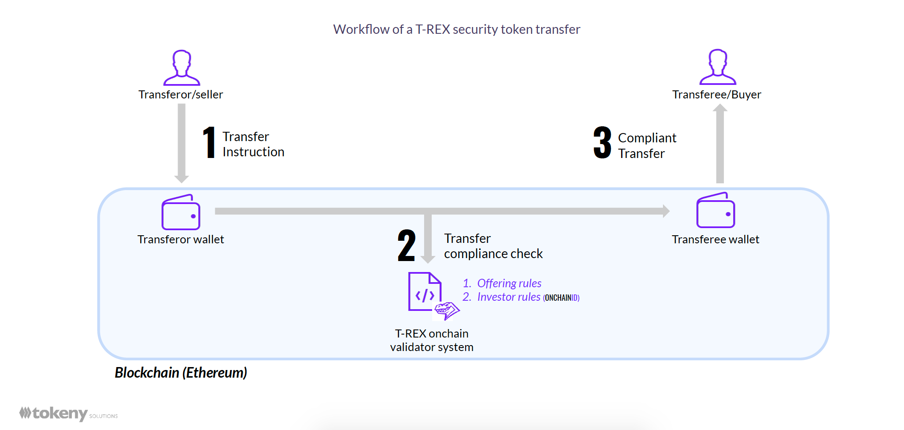
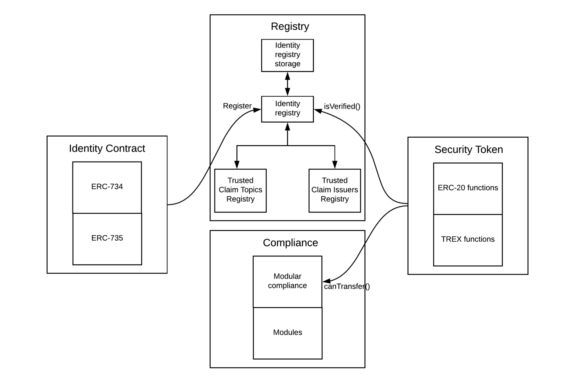

# What is ERC3643?

T-REX is the original implementation of the ERC-3643 standard, the source code can be found on [Tokeny's GitHub](https://github.com/TokenySolutions/T-REX).

ERC-3643 Smart Contracts enable compliant securities transfers via an onchain compliance trade validator system.
For each transfer, directly on the blockchain, the offering rules and the investor rules will be verified to validate or refuse the trade.

The management of compliant transactions through T-REX backed permission tokens is based on four main pillars creating a decentralized Validator:

1- ONCHAINID, a blockchain-based identity management system, allows for creating a globally accessible identity for every stakeholder.

2- A set of validation certificates; technically speaking, these certificates are the claims described in the ERC-734 and ERC-735 standards used by ONCHAINID, which will be described further in the document. For a better understanding, we will name these as certificates in this introductory section as it has a more semantical sense. Emitted by trusted third parties and signed onchain, each of them linked to a single ONCHAINID.

3- A transfer manager whose role is to act as a filter for all the transactions of tokenized securities and will check the validation certificates of the stakeholders. Essentially, the transfer manager will check that the receiver has the right to receive the tokens following the specific compliance rules and issuer requirements applicable for this specific asset. The transfer manager will block the transaction if the receiver misses a mandatory certificate and will notify him about the reason for the failure.

4- A set of Compliance rules ensuring that the rules of the offering are respected, e.g., the maximum number of investors per country of distribution, the maximum number of tokens held by a single investor, and more. These rules are linked to the identity of the receiver of a transaction and the global distribution of tokens at a certain time.

These four key elements allow issuers to use a decentralized validator to control transfers and enforce compliance on the security token holders. The Validator includes rules for the whole offering, such as managing the maximum number of holders allowed in a specific market.

